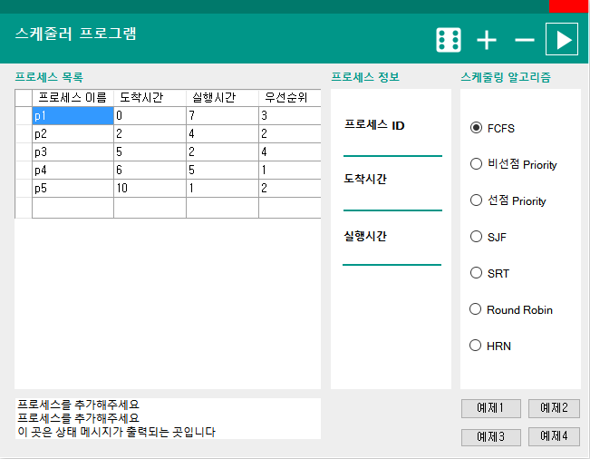
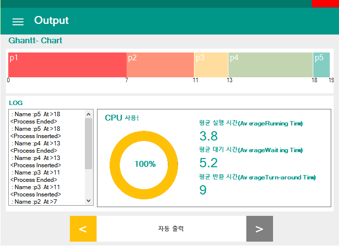

# OS-ya

OS-ya is Single Thread CPU Simulator for Operating System class Term Project

## Supportings

### Algorithms

FCFS					:first come first served  
Nonpreemptive Priority  
Preemptive Priority
SJF						:Short Job First  
SRT 					:Shortest Remaining First  
Round Robin  
HRN						:Highest Response Ratio Next  
  
### Visualizations
Ghantt- Chart
Pie Chart for CPU USAGE

Average Running Time
Average Waiting Time
Average Turn-around Time

Step by Step Animation

